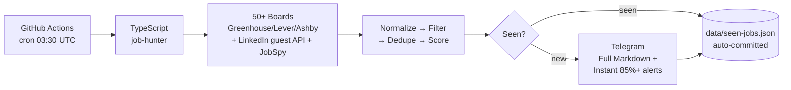

<div align="center">

[](https://git.io/typing-svg)

<p>
  
  
  
  
  
  
</p>

<p>
  <b>Searches 50+ boards → filters → dedupes → scores → pings you on Telegram</b><br>
  Runs entirely on <code>GitHub Actions</code>. Sleeps on your laptop.
</p>

[✨ Use as template](https://github.com/do29wdn/job-hunt/generate) • [⚡ Quick start](#-quick-start-30s) • [🧠 How it works](#-how-it-works) • [🔧 Config](#-fully-dynamic-config)

</div>

---

<div align="center">



</div>

### 🎯 What this is

> **Not a SaaS. Not a dashboard.** A boring, reliable cloud utility that feels like a personal job-hunting assistant.

It quietly wakes up, searches *everywhere* you care about, removes duplicates and noise, remembers what you've seen, and tells you:

> "Here are the new jobs you should actually look at."

Perfect for **Pune / Remote India / Global remote** Full Stack (`React • TypeScript • Node.js • PostgreSQL`).

---

### ⚡ Quick start (30s)

```bash
# 1. Clone as template
git clone https://github.com/do29wdn/job-hunt.git && cd job-hunt

# 2. Install
pnpm install

# 3. Telegram (recommended)
cp .env.example .env
# → talk to @BotFather on Telegram → /newbot → token
# → send hi to your bot → https://api.telegram.org/bot<TOKEN>/getUpdates → chat.id
# .env is loaded automatically on local runs — no dotenv dependency needed.

# 4. Run locally
pnpm run hunt      # discover only
pnpm run report    # digest last 3 days
pnpm start         # full pipeline (hunt + report)
DRY_RUN=true pnpm start   # real dry run — zero notifications sent

# 5. Cloud: add secrets in GitHub → Settings → Secrets → Actions
# TELEGRAM_BOT_TOKEN, TELEGRAM_CHAT_ID (and optional OPENAI_API_KEY)
# → Actions → Job Hunt Radar → Run workflow → full
```

---

### 🔥 Live demo

<div align="center">


```md
# 🚀 Job Hunt Report
**Period:** Last 3 days | **Found:** 1118 relevant | **New:** 1118

## 1. ⭐ Senior Software Engineer, Quality Engineering
**Company:** plane | **Location:** United States | **Match:** 98%
**Skills:** typescript • react • node.js • postgres | **Salary:** $130k
**Why:** Role matches + Strong skills: typescript, react
**Apply:** https://jobs.ashbyhq.com/plane/...
```

*Full markdown doc sent as Telegram file when >30 jobs. Instant alerts for 85%+ (watchlist 80%+) arrive separately.*

</div>

---

### 🧠 How it works

| Stage | File | What it does |
|---|---|---|
| **Search** | `src/sources/search.ts` | 50+ boards with a concurrency cap + per-request timeouts. Boards that are also on your watchlist are fetched only once (as the watchlist version). |
| **Normalize** | `src/pipeline/normalize.ts` | `company\|title\|location` fingerprint — punctuation-safe (no more phantom "new" jobs from `Remote - US` vs `Remote US`) |
| **Filter** | `src/pipeline/filter.ts` | Role aliases, shared location-tier logic, seniority blocklist. Watchlist companies are always reported (blocklist aside). |
| **Dedupe** | `src/pipeline/dedupe.ts` | Fingerprint + URL + externalId + location-aware fuzzy matching. Strategy configurable via `dedupeFingerprint`. |
| **Score** | `src/pipeline/score.ts` | Role 40 + strongSkills 30 + location 15 + remote 10 + recency 5 + visa/IST/watchlist bonuses, capped 0-100 |
| **AI (opt)** | `src/pipeline/ai.ts` | If `OPENAI_API_KEY` set, deep-enriches relevant jobs **once, at hunt time** — the report reuses stored results |
| **Store** | `src/storage/seen-jobs.ts` | `data/seen-jobs.json` (descriptions stripped — minimal state) + `data/ats-health.json`, auto-committed |
| **Notify** | `src/notifications/telegram.ts` | Summary HTML + full Markdown doc (chunked) + instant alerts. `DRY_RUN=true` suppresses ALL of it for real. |

**Sources (fully dynamic via config):**
- **Greenhouse 30:** `databricks`, `anthropic`, `stripe`, `gitlab`, … `boards-api.greenhouse.io/v1/boards/{board}/jobs`
- **Ashby 15:** `openai`, `airwallex`, `notion`, `cursor`, … `api.ashbyhq.com/posting-api/job-board/{board}`
- **Lever 1:** `spotify` `api.lever.co/v0/postings/{board}`
- **SmartRecruiters:** optional `api.smartrecruiters.com/v1/companies/{board}/postings`
- **LinkedIn 5:** public guest search API (no auth, no scraping deps)
- **JobSpy 2:** `naukri` + `linkedin`/`indeed` via the `python-jobspy` bridge `scripts/jobspy_bridge.py` (config passed as a JSON file — nothing is ever interpolated into a shell command)

---

### 🔧 Fully dynamic config

No code change needed — edit `data/config.json`:

```json
{
  "greenhouseBoards": ["databricks", "anthropic", "gitlab"],
  "ashbyBoards": ["openai", "notion"],
  "linkedinBoards": ["Full Stack Developer @ Pune, India", "React Developer @ Remote"],
  "jobspyBoards": [{ "site": ["naukri", "linkedin"], "searchTerm": "Full Stack", "location": "Pune, India", "resultsWanted": 20 }],
  "preferredLocations": ["pune", "remote india", "bengaluru"],
  "remoteGlobalAllowed": false,
  "roles": ["Full Stack Developer", "React Developer"],
  "skills": ["typescript", "react", "node.js"],
  "minScoreToReport": 40,
  "topN": 15,
  "instantAlertThreshold": 85,
  "watchlistBoost": 10,
  "dedupeFingerprint": "both",
  "healthPath": "data/ats-health.json",
  "reportFull": true,
  "maxFullReportJobs": 150,
  "healthEnabled": true
}
```

Notes:
- `remoteGlobalAllowed: false` genuinely blocks generic "Remote" postings — add specific entries like `"remote india"` for the ones you want. Bare `"remote"` in `preferredLocations` is treated as the global-remote bucket (+10, not +15).
- `instantAlertThreshold` (config or `INSTANT_ALERT_THRESHOLD` env) controls instant alerts; watchlist jobs alert at threshold − 5.
- `watchlistBoost` and `dedupeFingerprint` are honoured — no more hardcoded values.

Watchlist (always reported + boost) in `data/watchlist.json`:
```json
{"companies": [{"slug":"vercel","ats":"greenhouse"}, {"slug":"linear","ats":"ashby"}]}
```
Boards that appear in both the watchlist and a main list are fetched once, as the watchlist version.

All keys are `passthrough` — add anything, it just works.

---

### 🩺 Self-healing

`data/ats-health.json` tracks per-board `success/fail/latency/avgJobs`. After 3 consecutive fails → auto-disabled 7 days, skipped on later runs, auto re-enabled on success. JobSpy failures count too (the bridge exits non-zero on error). Weekly digest sent to Telegram on Sundays (IST).

```bash
cat data/ats-health.json | jq
```

---

### 🔔 Notifications

**Telegram (recommended):**
```bash
# 1. @BotFather → /newbot → copy TELEGRAM_BOT_TOKEN
# 2. Send hi to your bot
# 3. https://api.telegram.org/bot<TOKEN>/getUpdates → chat.id = TELEGRAM_CHAT_ID
# 4. Add both as GitHub Secrets
```

**Email (optional):** `RESEND_API_KEY` + `RESEND_TO`, or real SMTP via nodemailer: `SMTP_HOST` + `SMTP_PORT` + `SMTP_USER` + `SMTP_PASS` + `EMAIL_TO`.

**AI explanations (optional):** add `OPENAI_API_KEY` (+ `OPENAI_MODEL=gpt-4o-mini`) — enriches relevant jobs with `why relevant`/`gaps`, paid for once at hunt time.

---

### ⏰ Scheduling

`.github/workflows/job-hunt.yml`:

```yaml
schedule:
  - cron: "30 3 * * *"      # daily hunt 09:00 IST
  - cron: "45 3 1,4,7,10,13,16,19,22,25,28,31 * *"  # full digest every 3 days
workflow_dispatch: # manual hunt/report/full (with a dry-run toggle that works)
```

The scheduled runs are told apart by *which cron expression fired* (`github.event.schedule`), not by wall-clock time, so GitHub's cron jitter can't turn a daily hunt into a full report. A concurrency group keeps two runs from racing on the state files.

`ci.yml` runs typecheck + the test suite on every push/PR.

---

### 📂 Structure

```
src/
  config.ts          # Zod schema, passthrough dynamic
  env.ts             # dependency-free .env loader + DRY_RUN helper
  types.ts           # NormalizedJob/ScoredJob/JobSource
  utils.ts           # fetch-with-timeout, escaping, entity decoding, pLimit
  sources/           # greenhouse/lever/ashby/smartrecruiters/linkedin/jobspy/watchlist/search.ts
  pipeline/          # normalize/filter/dedupe/score/ai/health.ts + ds.ts (Aho-Corasick & friends)
  storage/seen-jobs.ts
  notifications/     # telegram (full md + instant) / email (Resend + SMTP)
  __tests__/         # node:test suite — pnpm test
  index.ts           # hunt → report orchestration
scripts/
  jobspy_bridge.py   # python-jobspy bridge (config via JSON file, errors exit non-zero)
data/
  config.json        # all boards + prefs (dynamic)
  watchlist.json     # ⭐ priority companies
  seen-jobs.json     # auto-committed (minimal records, no descriptions)
  ats-health.json    # auto-committed
```

---

### 🚀 Use as template

1. **Use this template** → create your repo
2. Edit `data/config.json` + `data/watchlist.json` for your stack/location
3. Add `TELEGRAM_BOT_TOKEN` + `TELEGRAM_CHAT_ID` to repo Secrets
4. `Actions → Run workflow` → done. Runs forever.

---

<div align="center">

**Built for Pune, ready for worldwide remote** 🌍

*If it saves you one hour of job hunting a week, it's working.*

⭐ Star if it helps — PRs for new board adapters welcome!

</div>
